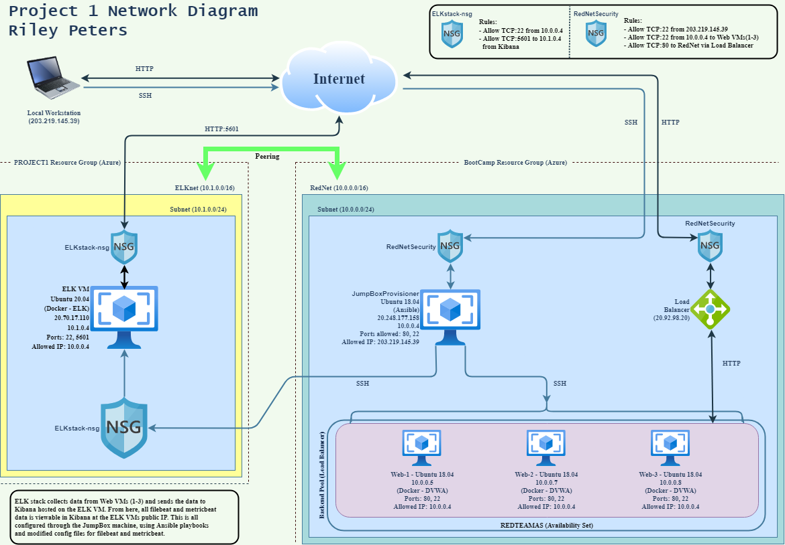

# Cyber Portfolio - Project 1 - ELK Deployment
A repository serving as a location to house all scripts, playbooks and projects worked on during the completion of the Cybersecurity Bootcamp with the University of Sydney. For now, this repository is dedicated to **Project 1** files. Once new content is added, the **Project 1** files will be stored in their own directory in `main`. A second repository will also be made containing all notes and summaries for each week's class content.

# **Automated ELK Stack Deployment**

The files in this repository were used to configure the network depicted below.

These files have been tested and used to generate a live ELK deployment on Azure. They can be used to recreate the deployment pictured above. 
Alternatively, select portions of the YAML file may be used to install only certain pieces of it, such as Filebeat.

  - docker-setup.yml -----------------------> To be run on webserver machines to setup docker and DVWA.
  - filebeat-metricbeat-setup.yml ----------> To be run on webserver machines once docker is configured, sets up file and metric beats..
  - ELK-setup.yml --------------------------> To be run on the ELK stack machine for setup.

This README does not cover setting up and configuring the **Web VMs** in detail, however the playbook `docker-setup.yml` above is what was
used to install and configure the instance used on each Web VM. The JumpBox machine is a standalone VM running an Ansible instance through
docker. If details are needed on how to set up these machines, contact the repository owner and ask for access to the setup instructions for 
"Cloud Security" located in another repository, and a link will be provided.

Additional scripts have been provided in the Linux directory. These simple scripts are not necessary to run, but can perform helpful system 
administration, cleanup, and update tasks in a Linux environment. Also included is very a basic Lynis script combination, which can perform
either full or partial system audits.

This document contains the following details:
- Description of the Topology
- Access Policies
- ELK Configuration
  - Beats in Use
  - Machines Being Monitored
- How to Use the Ansible Build

### **Description of the Topology**

The main purpose of this network is to expose a load-balanced and monitored instance of DVWA, the D*mn Vulnerable Web Application.

Load balancing ensures that the application will be highly secure, in addition to restricting access to the network.
The Load Balancer in this network configuration acts as a public gateway to access the webservers whilst also providing protection to
all these webservers, ensuring that even if two of the machines are taken offline malicously the DVWA instance is still publicly accessible.
This is important as availability is a key aspect of security. 

Integrating an ELK server allows users to easily monitor the vulnerable VMs for changes to the log files and system services.
- Filebeat monitors the log files or locations that you specify, collects log events, and forwards them either to 
  Elasticsearch or Logstash for indexing.
- Metricbeat is used to periodically collect metrics from the operating system and from services running on the server.

**The configuration details of each machine may be found below.**

| Name     | Function | IP Address | Operating System |
|----------|----------|------------|------------------|
| Jump Box | Gateway  | 10.0.0.4   | Linux            |
| Web-1    | Webserver| 10.0.0.5   | Linux            |
| Web-2    | Webserver| 10.0.0.7   | Linux            |
| Web-3    | Webserver| 10.0.0.8   | Linux            |

---

### **Access Policies**

The machines on the internal network are not exposed to the public Internet. 

Only the Jump Box machine can accept connections from the Internet. Access to this machine is only allowed from the following IP addresses:
- 203.219.145.39 (local machine)
- It may be beneficial to instead use a VM for access to the JumpBox and ensure it has a static IPv4, as most standard routers will assign
  dynamic IPv4's to local machines and this will create the need to regularly adjust network security group rules.

Machines within the network can only be accessed by SSH.
- ELK VM is also only accessible through the Jump Box machine through SSH.

**A summary of the access policies in place can be found in the table below.**

| Name         | Publicly Accessible | Allowed IP Addresses |
|--------------|---------------------|----------------------|
| Jump Box     | Yes                 | 203.219.145.39       |
| Web-1        | No                  | 10.0.0.4             |
| Web-2        | No                  | 10.0.0.4             |
| Web-3        | No                  | 10.0.0.4             |
| ELK VM       | No                  | 10.0.0.4             |
| LoadBalancer | Yes                 | Any                  |

---

### **Elk Configuration**

Ansible was used to automate configuration of the ELK machine. No configuration was performed manually, which is advantageous because it means
that redeploying a new ELK stack as well as a new DVWA instance is extremely easy and centralised. In the scenario where any of the Web VMs or
even the ELK VM fails, repairing or implementing a new instance is as simple as running an Ansible playbook and letting it handle all the
reconfiguration.

The playbook implements the following tasks:
- Uses the **apt** module to install both **docker.io** and **python3-pip**.
- The **pip** module will then install the docker module.
- Then using the command module, the VMs max memory is increased and then used. This ensures the ELK container can use a full 4GB of RAM.
- Finally, the ELK container is downloaded and initiated. Systemd will also ensure the docker service is enabled.

The following screenshot displays the result of running `docker ps` after successfully configuring the ELK instance.

---

#### **Target Machines & Beats**
This ELK server is configured to monitor the following machines:
- Web-1 (10.0.0.5)
- Web-2 (10.0.0.7)
- Web-3 (10.0.0.8)

We have installed the following Beats on these machines:
- Filebeat
- Metricbeat

These Beats allow us to collect the following information from each machine:
- **Filebeat:** installs as an agent on your server and proceeds to monitor certain specified log files or locations, as well as collect
  log events, and forwards all data to Elasticsearch for indexing. As an example, filebeat could be used to collect log events related to
  **apache2** and record any errors.
- **Metricbeat:** periodically collects operating system metrics as well as data from services currently running on the server. For example,
  metricbeat could be configured to collect metrics from the **nginx** service and forward that data to Elasticsearch.

---

### **Using the Playbook**
In order to use the playbook, you will need to have an Ansible control node already configured. Assuming you have such a control node provisioned: 

SSH into the control node and follow the steps below:
- Copy the configuration files for filebeat & metricbeat to `/etc/ansible/files`.
- Update the config file to include your ELK VMs private IP and the Elasticsearch login (default). Follow Filebeat/Metricbeat official config guide.
- Update the `hosts` file for Ansible, located at `/etc/ansible/`. Include IP for Web VMs under `[webservers]` as well as create `[elk]` and add
  the ELK VM's internal IP underneath.
- Run the playbook, and navigate to `http://{ELK VM Public IP}:5601/app/kibana` to check that the installation worked as expected.
- Once on this page, to access data and metrics being recorded by Filebeat and Metricbeat, click **Add log data** or **Add metric data** and
  select either **System Logs** for Filebeat or **Docker Metrics** for Metricbeat. Then simply click **Check Data** at the bottom to navigate to
  your data.

---

### **Bonus Helpful Commands**
These commands provided below will help you download and run the various playbooks stated above, as well as steps to update the configuration files with your needed IPs.
- Downloading the docker playbook for Web VM configuration:

   `curl -o docker-setup.yml https://raw.githubusercontent.com/riley-peters/Portfolio-Cybersecurity/main/Ansible/docker-setup.yml?token=GHSAT0AAAAAABVCTVVJNCO5HYDTRIPRPK36YU665PQ`
  
  Do this step inside the Ansible container running on the JumpBox machine. Ensure the Web VM private IPs have been added to the ansible `hosts` file prior.
  Steps to do this are detailed above in **Using the Playbook**.

- Downloading the ELK playbook:
  Run the command to download the YAML file to your current directory under the name `ELK-setup.yml`.
  
   `curl -o ELK-setup.yml https://raw.githubusercontent.com/riley-peters/Portfolio-Cybersecurity/main/Ansible/ELK-setup.yml?token=GHSAT0AAAAAABVCTVVJ77IO4UELCRYXQ57CYU666FA`
  
  Store the playbook at `/etc/ansible/files`.

- Downloading the Filebeat/Metricbeat playbook:
  Run the command to download the YAML file to your current directory under the name `filebeat-metricbeat-setup.yml`.
  
   `curl -o filebeat-metricbeat-setup.yml https://raw.githubusercontent.com/riley-peters/Portfolio-Cybersecurity/main/Ansible/filebeat-metricbeat-setup.yml?token=GHSAT0AAAAAABVCTVVJM2T6CC7QF2N7W3I2YU666WQ`
  
  Store the playbook at `/etc/ansible/roles`.

- Third, ensure you have downloaded both a fresh filebeat and metricbeat configuration file. Make sure these files are stored at `/etc/ansible/files`.
  For each file, go to the line containing:
  `output.elasticsearch:` and edit the host to your internal IP followed by `:9200` for the ELK VM as well as the default Elasticsearch login:
  **username**: "elastic"
  **password**: "changeme"
  Then navigate to the line containing:
  `setup.kibana:` and add `"{ELK VM Private IP}:5601"` in the **host** line underneath.
  
  Once this is complete, the playbook **"filebeat-metricbeat-setup.yml"** is ready to be run with this command:
  `ansible-playbook /etc/ansible/roles/filebeat-metricbeat-setup.yml`
  It is now possible to check whether Kibana is receiving log and metric data. Steps to do this are detailed above in **Using the Playbook**.
